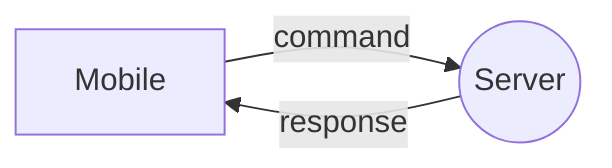

# [Easy Connect](https://royce-mathew.github.io/Hackville2023/)

  

## Introduction
Our submission for Hackville 2023. A remote desktop control application that lets you control your desktop using your phone. Our project provides a convenient and efficient way for you to manage your desktop.

We believe our project will provide a valuable solution to individuals who are inexperienced with technology. People who are inexperienced with technology generally have a harder time working on their desktop compared to their mobile phones. We are confident that our application will provide a smooth and seamless user experience.

### Features
* ✅ User-friendly display
* 💻 Automatically open Google Search and Wikipedia
* 🎵 Play music on your desktop through your phone!
* 🎚️ Changes volume and brightness

## Technical Details
This is how the communication between the desktop and the mobile phone is set up. The desktop displays the user for a code, the user then enters the code being displayed on their mobile-phone. After this connection is developed, the mobile-phone is able to send specific commands and the desktop automatically runs those commands.

### Libraries and Tools used
- React, React-native for front end
- Flask for back-end
- Selenium for automation
